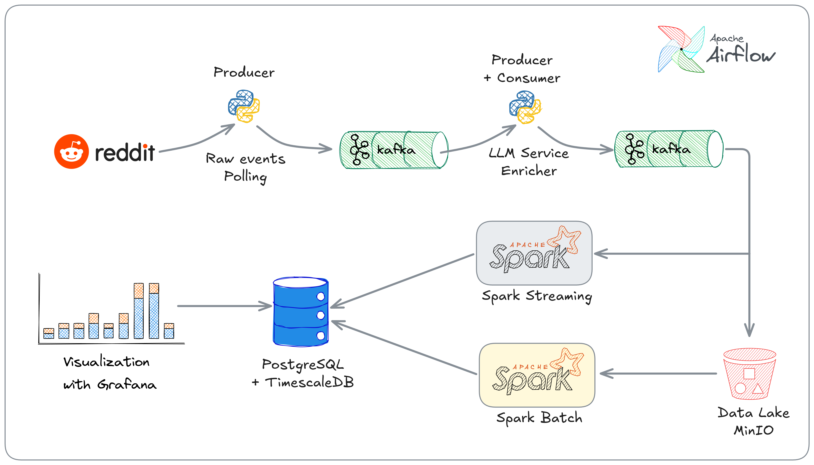

# Carthage Pulse

Real-time Reddit analytics pipeline with LLM-powered sentiment analysis, topic extraction, and entity recognition, focused on Tunisian social media content.

## Architecture

Carthage Pulse follows a Lambda Architecture with batch and speed layers for real-time and historical analytics. Reddit posts and comments are ingested from the API and published to Kafka. A processing service consumes these events, enriches them with LLM analysis (sentiment, topics, entities, translation), and publishes enriched events back to Kafka. A storage service persists both raw and enriched data to MinIO and PostgreSQL. Spark Streaming jobs consume from Kafka to compute real-time trending topics and words, while Spark Batch jobs handle historical analysis. Results are stored in PostgreSQL and visualized through Grafana dashboards. The entire pipeline is orchestrated by Apache Airflow, providing automated scheduling, monitoring, and retry logic for all services.



## Services

| Service | Description |
|---------|-------------|
| `ingestion` | Fetches posts/comments from Reddit API and publishes to Kafka |
| `processing` | Consumes Kafka events, enriches with LLM analysis (sentiment, topics, entities, translation) |
| `storage` | Persists enriched events to MinIO (object storage) |
| `speed` | Spark Streaming jobs for real-time analytics (trending topics, trending words) |
| `batch` | Spark Batch jobs for historical analysis (daily, hourly, weekly) |
| `airflow` | Apache Airflow orchestrator for automated pipeline management |
| `presentation` | Grafana dashboards for real-time metrics and trends |


## Quick Start

### Prerequisites

- Docker & Docker Compose
- Python 3.10+
- [uv](https://github.com/astral-sh/uv) package manager

### 1. Start Infrastructure

```bash
docker compose up -d
```

This starts all services including:
- Kafka, MinIO, PostgreSQL, Spark
- Airflow webserver and scheduler
- Grafana dashboards

### 2. Configure

```bash
cp .env.example .env
# Edit .env with your API keys
```

Review `config/dev.yaml` for pipeline settings (subreddits, LLM provider, batch sizes, etc.).

### 3. Run the Pipeline with Airflow

**Access Airflow UI:**
```
http://localhost:8088
```
Login: `admin` / `admin`

### 4. Access Grafana Dashboards

**Access Grafana UI:**
```
http://localhost:3000
```
Login: `admin` / `admin`


